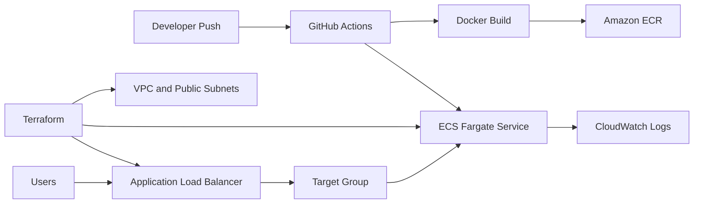

# ECS Fargate CI/CD with Terraform and GitHub Actions

> **Stage 2 of 12 — Career Progression Project**  
> Portfolio project by **Yugandhar Ethamukkala**.

This project demonstrates how to deploy a containerized Python Flask application to **Amazon ECS Fargate** using **Terraform** for infrastructure provisioning and **GitHub Actions** for CI/CD automation.

The goal of this project is to show a practical AWS container deployment workflow without managing Kubernetes worker nodes. It focuses on infrastructure as code, Docker image build/push, ECR, ECS Fargate service deployment, ALB routing, and cleanup/cost-control.

## Career Progression Story

After building a Jenkins-based CI/CD foundation in Project 1, I moved into AWS managed container deployments. In this project, I used ECS Fargate to run containers without managing EC2 instances or Kubernetes nodes.

This repo represents the next stage in my DevOps portfolio path: moving from basic CI/CD into cloud-native AWS deployment using Terraform, ECR, ECS Fargate, Application Load Balancer, and GitHub Actions.

## What This Project Demonstrates

- Containerizing a Flask application using Docker
- Provisioning AWS infrastructure using Terraform
- Creating an Amazon ECR repository for container images
- Deploying containers on Amazon ECS Fargate
- Exposing the service through an Application Load Balancer
- Using GitHub Actions to build, push, and deploy container images
- Adding Terraform apply and destroy workflows for infrastructure lifecycle management
- Keeping cleanup commands documented to avoid unnecessary AWS cost

## Tech Stack

`Python` `Flask` `Docker` `Amazon ECS` `AWS Fargate` `Amazon ECR` `Terraform` `GitHub Actions` `ALB` `CloudWatch`

## Architecture



## Repository Structure

```text
.
├── .github/
│   └── workflows/
│       ├── apply.yml
│       ├── destroy.yml
│       └── workflow.yml
├── terraform/
│   └── main.tf
├── docs/
│   └── screenshots/
├── app.py
├── Dockerfile
├── requirements.txt
├── README.md
├── REPO_UPLOAD_CHECKLIST.md
├── PROJECT_REVIEW_NOTES.md
└── project.yaml
```

## Application Overview

The Flask application exposes two routes:

| Route | Purpose |
|---|---|
| `/` | Returns a basic service response with hostname and environment |
| `/health` | Used by the load balancer target group for health checks |

## Local Run

Create a virtual environment and run the app locally:

```bash
python -m venv .venv
source .venv/bin/activate
pip install -r requirements.txt
python app.py
```

On Windows PowerShell:

```powershell
python -m venv .venv
.\.venv\Scripts\activate
pip install -r requirements.txt
python app.py
```

Test locally:

```bash
curl http://localhost/health
curl http://localhost/
```

## Docker Build and Test

```bash
docker build -t ecs-fargate-terraform-github-actions:local .
docker run -p 8080:80 ecs-fargate-terraform-github-actions:local
```

Test the container:

```bash
curl http://localhost:8080/health
```

## Terraform Validation

Before applying infrastructure, validate the Terraform code:

```bash
terraform -chdir=terraform fmt
terraform -chdir=terraform init
terraform -chdir=terraform validate
terraform -chdir=terraform plan
```

## Deployment Overview

### Step 1: Create AWS credentials or OIDC setup

For a learning lab, you can use GitHub repository secrets:

```text
AWS_ACCESS_KEY_ID
AWS_SECRET_ACCESS_KEY
AWS_REGION
ECR_REPOSITORY_NAME
ECS_CLUSTER
ECS_SERVICE
ECS_TASK_DEFINITION
```

For production, use GitHub Actions OIDC with an IAM role instead of long-lived access keys.

### Step 2: Provision infrastructure

Run the `Terraform Apply` GitHub Actions workflow manually, or run locally:

```bash
terraform -chdir=terraform init
terraform -chdir=terraform apply
```

Terraform creates:

- VPC
- Public subnets
- Internet Gateway
- Route table
- Security groups
- ECR repository
- ECS cluster
- ECS task execution role
- ECS Fargate task definition
- ECS service
- Application Load Balancer
- Target group
- CloudWatch log group

### Step 3: Build and deploy the application

After infrastructure is ready, push code to the `main` branch. GitHub Actions will:

1. Checkout source code
2. Authenticate to AWS
3. Login to Amazon ECR
4. Build the Docker image
5. Push the image to ECR using the Git commit SHA as the image tag
6. Download the current ECS task definition
7. Update the task definition with the new image
8. Deploy the new task definition to ECS Fargate

## Screenshots

The uploaded source folder for this project did **not** include existing project screenshots or architecture images, so I prepared the screenshot folder for you.

After you run this project, add screenshots here:

```text
docs/screenshots/architecture.png
docs/screenshots/github-actions-success.png
docs/screenshots/ecr-image-pushed.png
docs/screenshots/ecs-service-running.png
docs/screenshots/alb-application-output.png
docs/screenshots/terraform-destroy-success.png
```

Do not upload screenshots that show AWS account IDs, secret values, billing details, private IPs, public IPs from your lab, or personal email addresses.

## Validation Commands

Useful commands after deployment:

```bash
aws ecs list-clusters
aws ecs list-services --cluster ecs-fargate-terraform-gha-cluster
aws ecs describe-services \
  --cluster ecs-fargate-terraform-gha-cluster \
  --services ecs-fargate-terraform-gha-service
```

Check Terraform outputs:

```bash
terraform -chdir=terraform output
```

Open the `load_balancer_url` output in the browser and verify the Flask application response.

## Cleanup / Cost Control

Always destroy cloud resources after testing:

```bash
terraform -chdir=terraform destroy -auto-approve
```

Optional ECR cleanup:

```bash
aws ecr delete-repository \
  --repository-name ecs-fargate-terraform-gha \
  --force
```

## Security Notes

- Do not commit AWS keys, `.env` files, Terraform state, kubeconfig, private keys, or tokens.
- Use GitHub repository secrets for lab workflows.
- Prefer GitHub Actions OIDC for production-grade AWS authentication.
- Use ECR image scanning and CloudWatch logs for basic visibility.
- Review Terraform plans before applying or destroying infrastructure.
- Keep AWS resources tagged and destroy unused labs to avoid cost.

## How I Would Explain This in an Interview

I built this project to demonstrate a cloud-native deployment workflow on AWS using ECS Fargate and Terraform. The application is a small Flask service, but the main focus is the DevOps flow around it: Dockerizing the application, provisioning AWS infrastructure with Terraform, storing the image in ECR, and deploying it as an ECS Fargate service behind an Application Load Balancer.

GitHub Actions handles the CI/CD flow. When code is pushed to the main branch, the workflow builds the Docker image, tags it with the Git commit SHA, pushes it to ECR, updates the ECS task definition, and deploys the new revision to the ECS service. I also added Terraform apply and destroy workflows so the infrastructure lifecycle is controlled and cleanup is documented to avoid unnecessary AWS charges.

---

<p align="center">
  
</p>

<h2 align="center">🤝 Connect With Me</h2>

<p align="center">
  <em>
    Thanks for visiting this project! I’m continuously building hands-on DevOps, Cloud, Automation, and AI-enabled engineering projects to improve real-world deployment, monitoring, and infrastructure skills.
  </em>
</p>

<p align="center">
  
</p>

<p align="center">
  <a href="https://github.com/yugandhar99" target="_blank" rel="noopener noreferrer">
    
  </a>
  <a href="https://www.linkedin.com/in/yugandhar-devops" target="_blank" rel="noopener noreferrer">
    
  </a>
  <a href="https://yugandhar-portfolio-psi.vercel.app/" target="_blank" rel="noopener noreferrer">
    
  </a>
  <a href="mailto:yugandharethamukkala1999@gmail.com">
    
  </a>
</p>

<p align="center">
  
  
  
  
</p>

---

<p align="center">
  ⭐ If this project added value, feel free to star the repository and connect with me!
</p>

<p align="center">
  <strong>Built with ❤️ using modern DevOps practices</strong>
</p>
